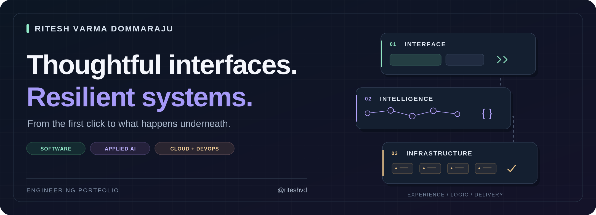
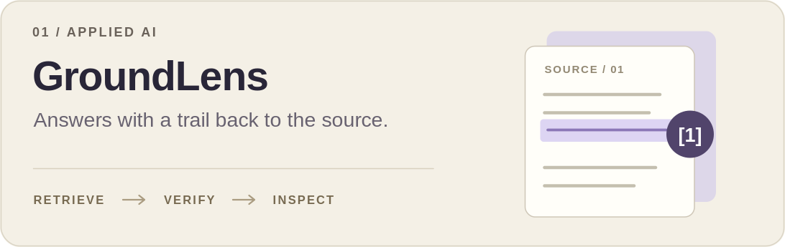
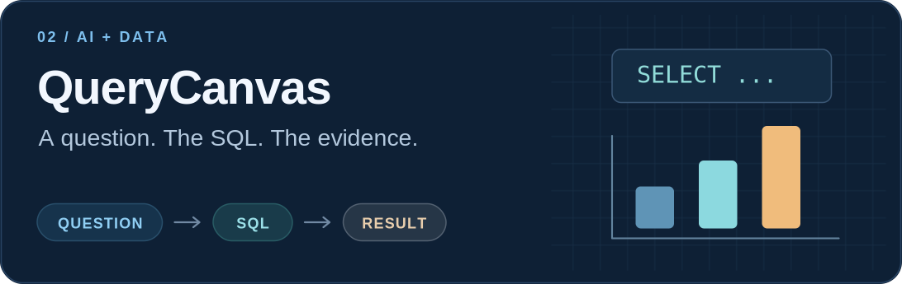
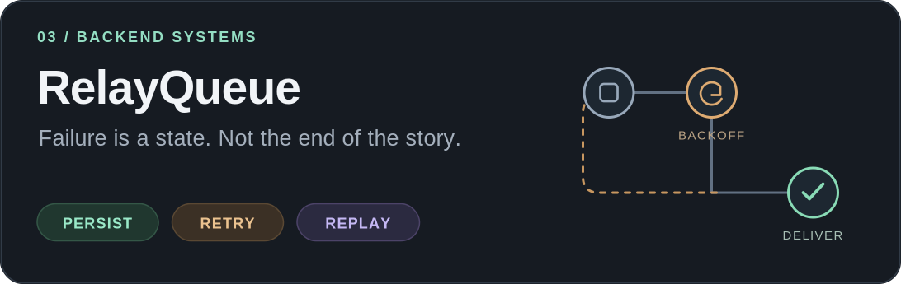
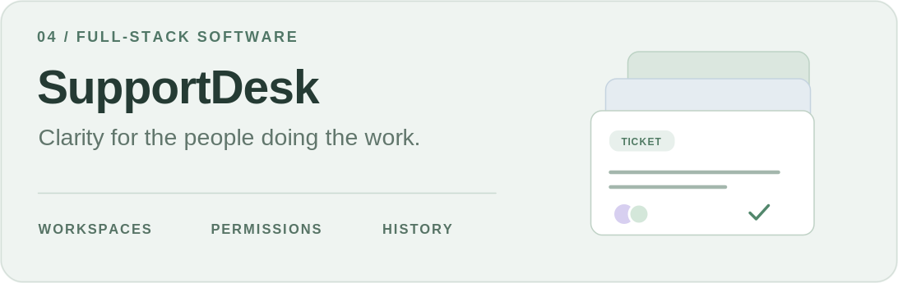
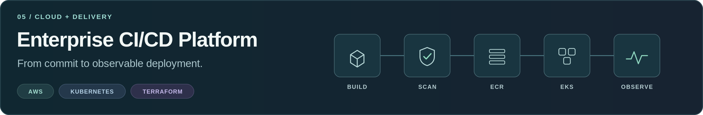

<!-- Profile README for riteshvd. Upload README.md AND the assets folder. -->

  <picture>
    <source media="(max-width: 640px)" srcset="./assets/header-mobile.png" />
    
  </picture>

  <a href="#portfolio-work">Selected work</a> &nbsp; / &nbsp;
  <a href="#portfolio-engineering">Under the hood</a> &nbsp; / &nbsp;
  <a href="#portfolio-toolbox">Toolbox</a> &nbsp; / &nbsp;
  <a href="mailto:dommarajuritesh@gmail.com">Get in touch</a>

## Hey, I'm Ritesh 👋

**I like software that feels simple to use—and has an interesting engineering story underneath.**

I'm a Computer Science graduate from **Southern Illinois University Carbondale**, with a background in **cloud and DevOps engineering**. My interests sit where product development meets systems thinking: inspectable AI, reliable backend workflows, and the infrastructure that supports them.

An answer should show its evidence. A retry should preserve its history. A deployment should be traceable to a change. Those ideas connect the projects below.

## Selected work 🚀

Five projects. Different problems. A shared interest in making the behavior visible.

<table>
  <tr>
    <td width="50%" valign="top">
      
      <h3><a href="https://github.com/riteshvd/groundlens">GroundLens</a></h3>
      
A document-research workbench that makes the path from source passage to answer inspectable.

      
<strong>Engineering detail:</strong> citation and exact-quote checks, optional hybrid retrieval, and explicit abstention paths.

      
<code>Python</code> <code>FastAPI</code> <code>Ollama</code> <code>SQLite</code>

      
<a href="https://github.com/riteshvd/groundlens#run-the-demo">Run locally ↗</a> &nbsp; · &nbsp; <a href="https://github.com/riteshvd/groundlens#design">Design notes ↗</a>

    </td>
    <td width="50%" valign="top">
      
      <h3><a href="https://github.com/riteshvd/querycanvas">QueryCanvas</a></h3>
      
A local analytics notebook connecting questions about CSV data to SQL, database rows, and charts.

      
<strong>Engineering detail:</strong> read-only query execution, bounded tool calls, and charts derived from returned data.

      
<code>Python</code> <code>FastAPI</code> <code>Ollama</code> <code>SQL</code>

      
<a href="https://github.com/riteshvd/querycanvas#run-locally">Run locally ↗</a> &nbsp; · &nbsp; <a href="https://github.com/riteshvd/querycanvas#how-execution-is-bounded">Execution boundaries ↗</a>

    </td>
  </tr>
  <tr>
    <td width="50%" valign="top">
      
      <h3><a href="https://github.com/riteshvd/relayqueue">RelayQueue</a></h3>
      
A durable webhook-delivery service with signed requests, a retry worker, and an operations dashboard.

      
<strong>Engineering detail:</strong> idempotency, expiring leases, stale-worker fencing, and dead-letter replay.

      
<code>TypeScript</code> <code>Node.js</code> <code>Fastify</code> <code>SQLite</code>

      
<a href="https://github.com/riteshvd/relayqueue#quick-start">Run locally ↗</a> &nbsp; · &nbsp; <a href="https://github.com/riteshvd/relayqueue#how-delivery-works">Delivery semantics ↗</a>

    </td>
    <td width="50%" valign="top">
      
      <h3><a href="https://github.com/riteshvd/supportdesk">SupportDesk</a></h3>
      
A full-stack ticket workspace for triage, assignment, comments, and the history behind each change.

      
<strong>Engineering detail:</strong> workspace-scoped authorization, revocable sessions, and stale-edit conflict detection.

      
<code>React</code> <code>TypeScript</code> <code>FastAPI</code> <code>PostgreSQL</code>

      
<a href="https://github.com/riteshvd/supportdesk#quick-start">Run locally ↗</a> &nbsp; · &nbsp; <a href="https://github.com/riteshvd/supportdesk#architecture-and-decisions">Architecture ↗</a>

    </td>
  </tr>
  <tr>
    <td colspan="2" valign="top">
      
      <h3><a href="https://github.com/riteshvd/enterprise-cicd-platform">Enterprise CI/CD Platform</a></h3>
      
A cloud-native delivery project connecting container builds and image scanning to AWS deployment and monitoring.

      
<strong>Engineering detail:</strong> infrastructure as code, deployment metadata, and application and cluster observability.

      
<code>AWS</code> <code>Terraform</code> <code>Docker</code> <code>Kubernetes</code> <code>Prometheus</code> <code>Grafana</code>

      
<a href="https://github.com/riteshvd/enterprise-cicd-platform#architecture-flow">Architecture flow ↗</a> &nbsp; · &nbsp; <a href="https://github.com/riteshvd/enterprise-cicd-platform#infrastructure">Infrastructure ↗</a>

    </td>
  </tr>
</table>

<strong>See the application interfaces</strong>

Screenshots published in the project repositories. These are local portfolio applications, not hosted production services. GroundLens and QueryCanvas offer no-model demo modes and optional Ollama integration.

### GroundLens · Document research

### QueryCanvas · Analytics notebook

### RelayQueue · Delivery operations

### SupportDesk · Ticket workspace

## Under the hood

**The questions I find more interesting than “which framework?”**

| Question | Explore it in |
| :--- | :--- |
| What evidence supports an AI answer—and when should the system abstain? | [GroundLens · retrieval and citation checks](https://github.com/riteshvd/groundlens#design) |
| What should a model be allowed to execute against a database? | [QueryCanvas · bounded tool use and read-only SQL](https://github.com/riteshvd/querycanvas#how-execution-is-bounded) |
| What happens if a worker crashes after the receiver processes a request? | [RelayQueue · at-least-once delivery](https://github.com/riteshvd/relayqueue#how-delivery-works) |
| How do you prevent a valid user from overwriting another user's newer edit? | [SupportDesk · authorization and concurrency](https://github.com/riteshvd/supportdesk#architecture-and-decisions) |
| Can a running deployment be traced back to the code that produced it? | [Enterprise CI/CD · deployment metadata](https://github.com/riteshvd/enterprise-cicd-platform#application) |

## Toolbox 🛠️

| Layer | Technologies and focus |
| :--- | :--- |
| **Languages & application development** | Python · TypeScript · Java · SQL · React · FastAPI · REST APIs |
| **Applied AI** | RAG · BM25 · Embeddings · Ollama · Tool calling · Citation validation |
| **Data & backend systems** | PostgreSQL · SQLite · Webhooks · Authentication · Background workers |
| **Cloud & delivery** | AWS · Azure · Docker · Kubernetes · Terraform · GitHub Actions · Jenkins · Linux |
| **Observability** | Prometheus · Grafana · Azure Monitor · Log Analytics |

---

<h2 align="center">Let's build something useful. 🤝</h2>

  Open to <strong>software engineering</strong>, <strong>applied AI</strong>, and <strong>cloud engineering</strong> opportunities.

  

  <a href="mailto:dommarajuritesh@gmail.com">dommarajuritesh@gmail.com</a>

