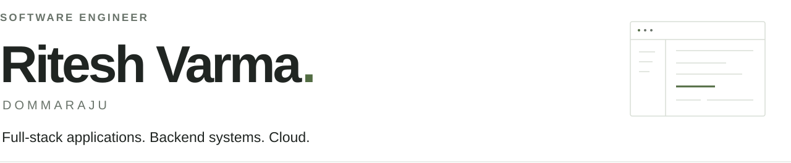
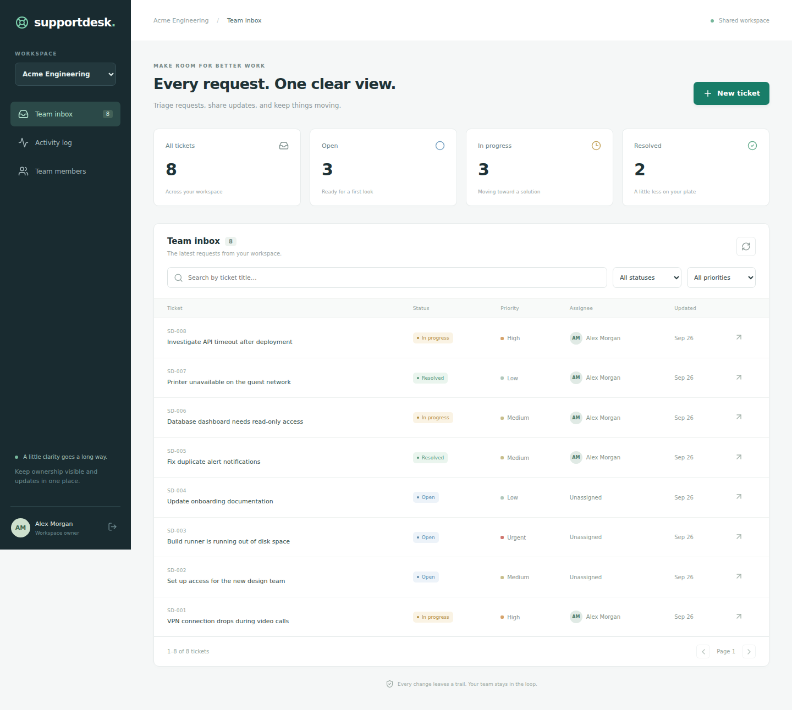
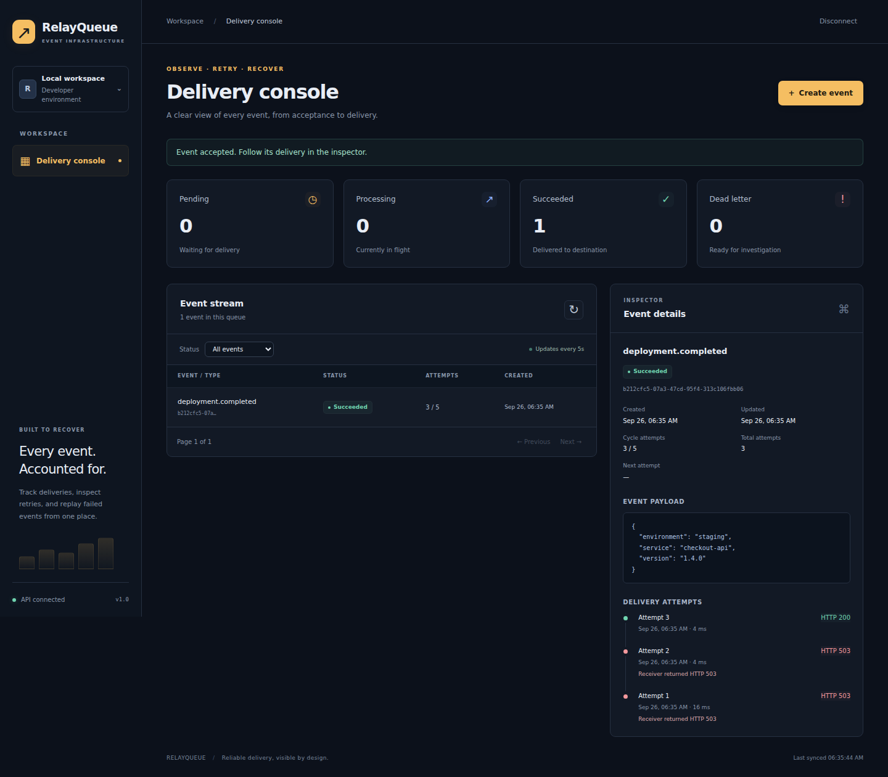
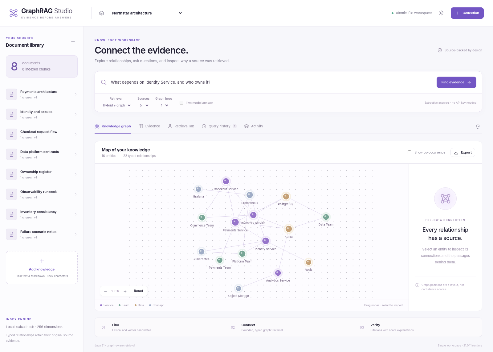
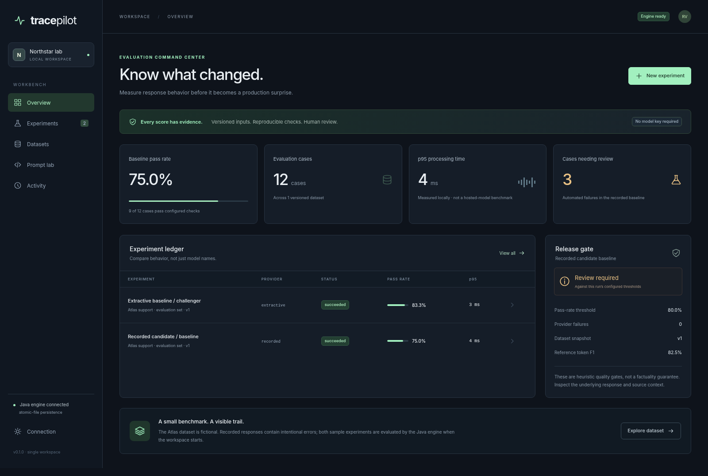

<picture>
  <source media="(prefers-color-scheme: dark)" srcset="profile-assets/header-dark.svg">
  <source media="(prefers-color-scheme: light)" srcset="profile-assets/header-light.svg">
  
</picture>

  <a href="https://ritesh.info"><strong>Portfolio ↗</strong></a>&nbsp;&nbsp; / &nbsp;&nbsp;
  <a href="https://www.linkedin.com/in/riteshvarmad/">LinkedIn</a>&nbsp;&nbsp; / &nbsp;&nbsp;
  <a href="mailto:dommarajuritesh@gmail.com">Email</a>&nbsp;&nbsp; / &nbsp;&nbsp;
  <a href="#selected-work">Selected work ↓</a>

 

I’m Ritesh, a software engineer with a background in cloud and DevOps. I build web applications across the interface, API, and database, and I enjoy working through the details that make them useful.

<h2>Selected work</h2>

A few projects across full-stack development, backend systems, and applied AI. Open a project to explore the code.

<table>
  <tr>
    <td width="50%" valign="top">
      
01 / FULL-STACK APPLICATION

      <h3><a href="https://github.com/riteshvd/supportdesk">SupportDesk ↗</a></h3>
      
      
A shared inbox for support requests. Sign in, assign tickets, and follow updates, with workspace permissions and protection against conflicting edits.

      
<code>React</code> <code>FastAPI</code> <code>PostgreSQL</code>

    </td>
    <td width="50%" valign="top">
      
02 / BACKEND &amp; DASHBOARD

      <h3><a href="https://github.com/riteshvd/relayqueue">RelayQueue ↗</a></h3>
      
      
A webhook service with a delivery dashboard. Submit events, inspect each attempt, and replay failures while background workers handle retries.

      
<code>TypeScript</code> <code>Fastify</code> <code>SQLite</code>

    </td>
  </tr>
  <tr>
    <td width="50%" valign="top">
      
03 / DOCUMENT SEARCH

      <h3><a href="https://github.com/riteshvd/graphrag-studio">GraphRAG Studio ↗</a></h3>
      
      
Search across documents and explore their connections in an interactive graph. Inspect the original passages behind an answer without leaving the workspace.

      
<code>Java</code> <code>Spring Boot</code> <code>JavaScript</code>

    </td>
    <td width="50%" valign="top">
      
04 / AI EVALUATION

      <h3><a href="https://github.com/riteshvd/tracepilot">TracePilot ↗</a></h3>
      
      
A workspace for testing AI responses. Compare prompt versions, inspect failed cases, and save review notes alongside repeatable evaluation runs.

      
<code>Java</code> <code>Spring Boot</code> <code>JavaScript</code>

    </td>
  </tr>
  <tr>
    <td colspan="2" valign="top">
      
05 / EVENT INTEGRITY

      <h3><a href="https://github.com/riteshvd/Proof-Pulse">Proof-Pulse ↗</a></h3>
      
An audit-trail prototype connecting a TypeScript ingestion service to a Java ledger. It records software events, checks linked history, and creates signed evidence bundles for verification.

      
<code>Java</code> <code>TypeScript</code> <code>PostgreSQL</code>

    </td>
  </tr>
</table>

 

<h2>Across the stack</h2>

<strong>Interface</strong>&nbsp; React, TypeScript, HTML &amp; CSS 
<strong>Application</strong>&nbsp; Java, Spring Boot, Python, FastAPI, Node.js 
<strong>Data &amp; delivery</strong>&nbsp; SQL, PostgreSQL, Docker, Azure, Terraform

I completed my master’s in Computer Science at Southern Illinois University Carbondale. My cloud and DevOps background shapes how I think about deployment, failures, and keeping an application understandable after it ships.

<strong>Have something in mind?</strong> <a href="mailto:dommarajuritesh@gmail.com">Let’s talk ↗</a> 
More projects and experience at <a href="https://ritesh.info">ritesh.info</a>

