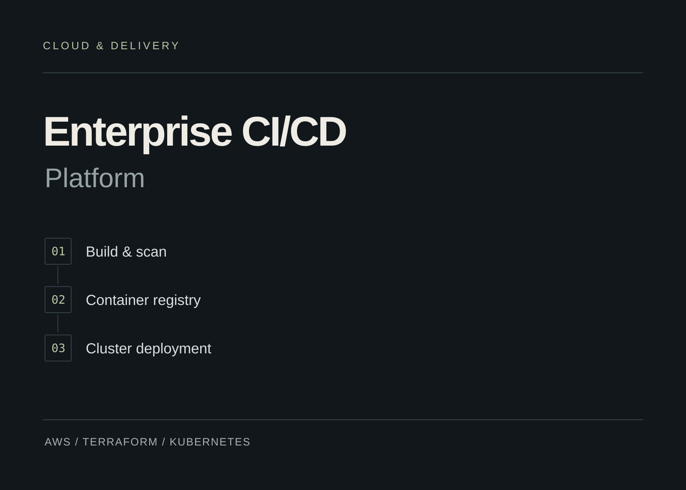
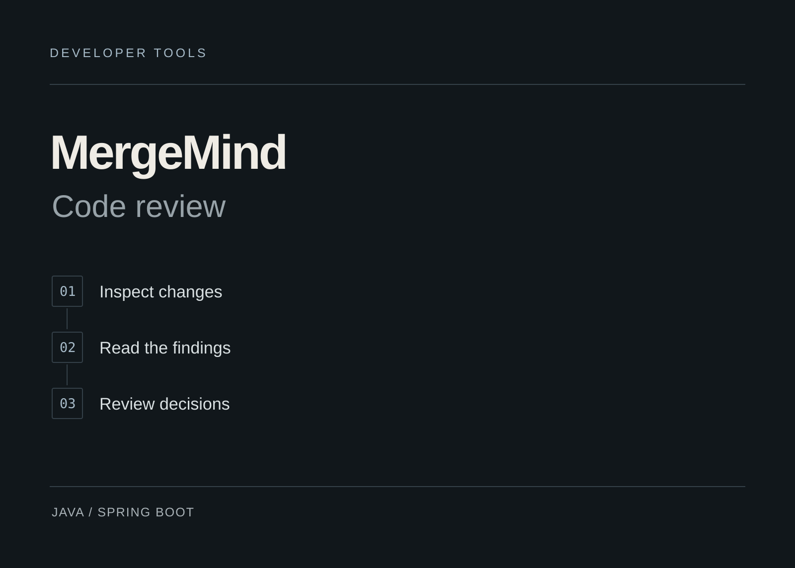
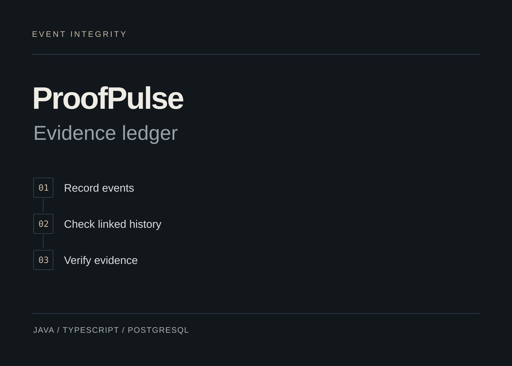

<picture>
  <source media="(prefers-color-scheme: dark)" srcset="profile-assets/header-dark.svg">
  <source media="(prefers-color-scheme: light)" srcset="profile-assets/header-light.svg">
  
</picture>

  <a href="https://ritesh.info"><strong>Portfolio ↗</strong></a>&nbsp;&nbsp; / &nbsp;&nbsp;
  <a href="https://www.linkedin.com/in/riteshvarmad/">LinkedIn</a>&nbsp;&nbsp; / &nbsp;&nbsp;
  <a href="mailto:dommarajuritesh@gmail.com">Email</a>&nbsp;&nbsp; / &nbsp;&nbsp;
  <a href="#selected-work">Selected work ↓</a>

 

I’m Ritesh, a Software Engineer with 3 years of experience building full-stack applications, distributed backend microservices, and cloud infrastructure across high-volume enterprise platforms like <strong>Walmart</strong> and <strong>U.S. Bank</strong>. I specialize in designing scalable APIs, automating deployment pipelines, and building practical AI/ML agent workflows.

<h2>Selected work</h2>

A few projects across full-stack development, backend systems, and applied AI. Open a project to explore the code.

<table>
  <tr>
    <td width="50%" valign="top">
      
01 / CLOUD &amp; DELIVERY

      <h3><a href="https://github.com/riteshvd/enterprise-cicd-platform">Enterprise CI/CD Platform ↗</a></h3>
      
      
An AWS deployment project connecting infrastructure, container builds, and Kubernetes releases. Includes vulnerability scanning, deployment metadata, and monitoring.

      
<code>AWS</code> <code>Terraform</code> <code>Kubernetes</code> <code>GitHub Actions</code>

    </td>
    <td width="50%" valign="top">
      
02 / DOCUMENT SEARCH

      <h3><a href="https://github.com/riteshvd/graphrag-studio">GraphRAG Studio ↗</a></h3>
      
      
Search across documents and explore their connections in an interactive graph. Inspect the original passages behind an answer without leaving the workspace.

      
<code>Java</code> <code>Spring Boot</code> <code>LangChain</code> <code>Pinecone</code>

    </td>
  </tr>
  <tr>
    <td width="50%" valign="top">
      
03 / CODE REVIEW

      <h3><a href="https://github.com/riteshvd/mergemind">MergeMind ↗</a></h3>
      
      
A Java code review project focused on inspecting changes, linking findings to source code, and recording review decisions.

      
<code>Java</code> <code>Spring Boot</code> <code>GitHub API</code>

    </td>
    <td width="50%" valign="top">
      
04 / EVENT INTEGRITY

      <h3><a href="https://github.com/riteshvd/Proof-Pulse">ProofPulse ↗</a></h3>
      
      
An audit-trail prototype connecting a TypeScript ingestion service to a Java ledger. It checks linked event history and creates signed evidence bundles for verification.

      
<code>Spring Boot</code> <code>NestJS</code> <code>PostgreSQL</code> <code>Redis</code>

    </td>
  </tr>
  <tr>
    <td width="50%" valign="top">
      
05 / AI EVALUATION

      <h3><a href="https://github.com/riteshvd/tracepilot">TracePilot ↗</a></h3>
      
      
A workspace for testing AI responses. Compare prompt versions, inspect failed cases, and save review notes alongside repeatable evaluation runs.

      
<code>Java</code> <code>Spring Boot</code> <code>Python</code> <code>FastAPI</code>

    </td>
    <td width="50%" valign="top">
      
06 / FULL-STACK APPLICATION

      <h3><a href="https://github.com/riteshvd/supportdesk">SupportDesk ↗</a></h3>
      
      
A shared inbox for support requests. Sign in, assign tickets, and follow updates, with workspace permissions and protection against conflicting edits.

      
<code>React</code> <code>TypeScript</code> <code>FastAPI</code> <code>PostgreSQL</code>

    </td>
  </tr>
</table>

 

<h2>Tech stack</h2>

<table>
  <tr><td><strong>Languages</strong></td><td>Python, Java, C++, SQL, Bash, Go</td></tr>
  <tr><td><strong>Frontend</strong></td><td>React, TypeScript, JavaScript, HTML &amp; CSS</td></tr>
  <tr><td><strong>Backend</strong></td><td>Java (Spring Boot), Python (FastAPI/Flask), Node.js (NestJS), REST APIs, GraphQL</td></tr>
  <tr><td><strong>Data &amp; Caching</strong></td><td>PostgreSQL, Redis, Flyway, SQLite</td></tr>
  <tr><td><strong>Applied AI &amp; LLMs</strong></td><td>LangChain, Pinecone, RAG architectures, Knowledge Graphs, PyTorch, MLflow</td></tr>
  <tr><td><strong>Cloud &amp; Delivery</strong></td><td>AWS (EKS, ECS, Lambda, S3, RDS), Azure (AKS), Docker, Kubernetes, Terraform, Helm, GitHub Actions, Azure DevOps</td></tr>
  <tr><td><strong>Monitoring &amp; Observability</strong></td><td>Prometheus, Grafana, Datadog, Splunk, Azure Monitor, Log Analytics</td></tr>
</table>

I completed my Master of Science in Computer Science at Southern Illinois University Carbondale, focusing on research in LLM reliability, collaborative coding, and knowledge graphs. My experience across enterprise platforms shapes how I build for resilience, automation, and long-term maintainability.

<strong>Have something in mind?</strong> <a href="mailto:dommarajuritesh@gmail.com">Let’s talk ↗</a> &nbsp;|&nbsp; 📞 (901) 522-5727 
More projects and experience at <a href="https://ritesh.info">ritesh.info</a>

